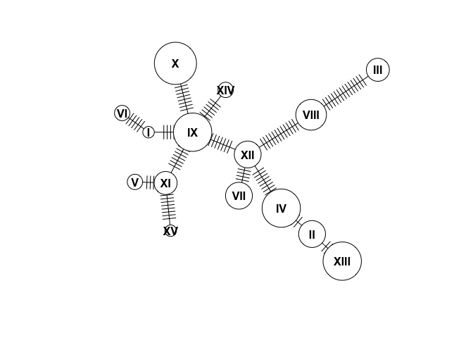
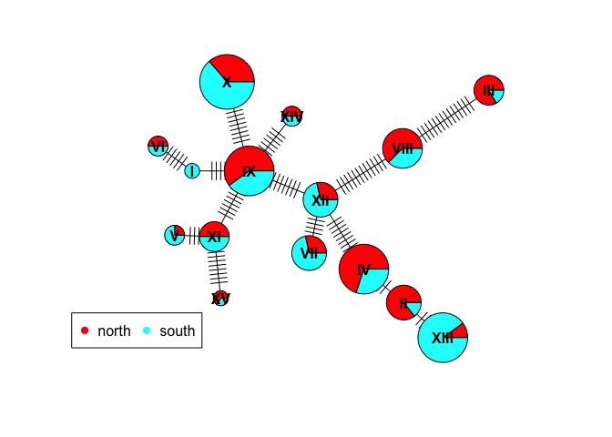

EVE 109 Section Week 5
================

### 1. Indexing

Today we'll use the "Arthritis" dataset from the `vcd` package to learn some functions. Let's install it:

``` r
install.packages("vcd")
```

``` r
library(vcd)
data(Arthritis)
?Arthritis
head(Arthritis)
```

    ##   ID Treatment  Sex Age Improved
    ## 1 57   Treated Male  27     Some
    ## 2 46   Treated Male  29     None
    ## 3 77   Treated Male  30     None
    ## 4 17   Treated Male  32   Marked
    ## 5 36   Treated Male  46   Marked
    ## 6 23   Treated Male  58   Marked

 

R and other programing languages use "indexing" to subset data. Indexing uses the order of entries (for example values in a vector or rows in a dataframe) to isolate particular entries. We've already used indexing to subset, maybe without even knowing it. For example, we know the command below gives us the *first* through *fourth* rows and the *first* through *third* columns. The numbers inside the brackes are called "indexes".

``` r
Arthritis[1:4,1:3]
```

    ##   ID Treatment  Sex
    ## 1 57   Treated Male
    ## 2 46   Treated Male
    ## 3 77   Treated Male
    ## 4 17   Treated Male

 

We can also use indexing to subet by a certain criteria. The command `which` returns indexes for all entries that meet a certain criteria. We saw a similar effect last week when we used `which.max`, but `which` is a more general command:

``` r
ind <- which(Arthritis$Sex=="Male")
ind
```

    ##  [1]  1  2  3  4  5  6  7  8  9 10 11 12 13 14 42 43 44 45 46 47 48 49 50
    ## [24] 51 52

This gives us the indexes of the rows in the Arthritis data frame where the patient was male. If we want to retrieve these rows, we can use that vector to pull out those rows:

``` r
Arthritis[ind,]
```

    ##    ID Treatment  Sex Age Improved
    ## 1  57   Treated Male  27     Some
    ## 2  46   Treated Male  29     None
    ## 3  77   Treated Male  30     None
    ## 4  17   Treated Male  32   Marked
    ## 5  36   Treated Male  46   Marked
    ## 6  23   Treated Male  58   Marked
    ## 7  75   Treated Male  59     None
    ## 8  39   Treated Male  59   Marked
    ## 9  33   Treated Male  63     None
    ## 10 55   Treated Male  63     None
    ## 11 30   Treated Male  64     None
    ## 12  5   Treated Male  64     Some
    ## 13 63   Treated Male  69     None
    ## 14 83   Treated Male  70   Marked
    ## 42  9   Placebo Male  37     None
    ## 43 14   Placebo Male  44     None
    ## 44 73   Placebo Male  50     None
    ## 45 74   Placebo Male  51     None
    ## 46 25   Placebo Male  52     None
    ## 47 18   Placebo Male  53     None
    ## 48 21   Placebo Male  59     None
    ## 49 52   Placebo Male  59     None
    ## 50 45   Placebo Male  62     None
    ## 51 41   Placebo Male  62     None
    ## 52  8   Placebo Male  63   Marked

Note that we could have just as easily done this:

``` r
Arthritis[Arthritis$Sex=="Male",]
```

When you do a command like this R finds the indexes and returns the rows for you, without you having to think about indexes. However, it can still be useful to know how indexes work, as we will see in the section today.

     

### 2. Using `table` to count across multiple columns

Previously we used the `table` function to count the number of times each value was observed in a specific column. Today we'll use the same function to create a matrix of counts across two different variables. First let's get some data. Install the package `vcd`, load the library and pull up the **Arthritis** dataset:

Notice that several of the columns are categorical. That means we can count how many times a certain category shows up.

Before, we made a table with just one column, like this:

``` r
table(Arthritis$Improved)
```

    ## 
    ##   None   Some Marked 
    ##     42     14     28

But what if we want to sort by another factor simultaneously. For example, we can see improvement based on treatment:

``` r
table(Arthritis$Treatment,Arthritis$Improved)
```

    ##          
    ##           None Some Marked
    ##   Placebo   29    7      7
    ##   Treated   13    7     21

     

### 3. Creating a haplotype network

Today we will use mtDNA sequences from an example dataset to learn to create a haplotype network. The package we will use is called `pegas`. Install this package and load the library.

``` r
install.packages("pegas")
```

``` r
library(pegas)
```

We will take advantage of a dataset called `woodmouse` that is part of the `pegas` package:

``` r
data(woodmouse)
woodmouse
```

    ## 15 DNA sequences in binary format stored in a matrix.
    ## 
    ## All sequences of same length: 965 
    ## 
    ## Labels:
    ## No305
    ## No304
    ## No306
    ## No0906S
    ## No0908S
    ## No0909S
    ## ...
    ## 
    ## Base composition:
    ##     a     c     g     t 
    ## 0.307 0.261 0.126 0.306 
    ## (Total: 14.47 kb)

Notice that woodmouse only has 15 individuals. We want to work with a few more, so we will artificially expand the dataset. We can do this by sampling with replacement using the command `sample`. Here we create a vector of the numbers 1:15, randomly sampled 100 times. We use that to choose individuals to sample (some multiple times) from the woodmouse dataset:

``` r
data <- woodmouse[sample(1:15,size=100,replace=T),]
data
```

    ## 100 DNA sequences in binary format stored in a matrix.
    ## 
    ## All sequences of same length: 965 
    ## 
    ## Labels:
    ## No306
    ## No0908S
    ## No0912S
    ## No0908S
    ## No1007S
    ## No305
    ## ...
    ## 
    ## Base composition:
    ##     a     c     g     t 
    ## 0.306 0.261 0.126 0.306 
    ## (Total: 96.5 kb)

 

Now we have 100 individuals! First, let's make up some metadata that we can use later. You can use the `labels` function to pull sample names out of `data`. We will also assign each sample to a random "north" or "south" location.

``` r
loc <- sample(c("north","south"),100,replace=T)
names <- labels(data)
meta <- data.frame(cbind(names,loc))
head(meta)
```

    ##     names   loc
    ## 1   No306 south
    ## 2 No0908S north
    ## 3 No0912S south
    ## 4 No0908S north
    ## 5 No1007S north
    ## 6   No305 south

NOTE: If we were doing this on real data, we would usually read in the populations from a spreadsheet. Here we just make them up to illustrate how the process works!

 

When we sequence DNA, some individuals will have the same haplotype. So the first step is to check how many haplotypes there are and which individuals share haplotypes. We do this with the `haplotype` function:

``` r
hap <- haplotype(data)
hap
```

    ## 
    ## Haplotypes extracted from: data 
    ## 
    ##     Number of haplotypes: 15 
    ##          Sequence length: 965 
    ## 
    ## Haplotype labels and frequencies:
    ## 
    ##    I   II  III   IV    V   VI  VII VIII   IX    X   XI  XII XIII  XIV   XV 
    ##    8   10    7    6    9   10    5    6    7    7    5   10    4    4    2

 

In the output you can see the frequencies of each of the 15 haplotypes. Now we want a list of which individuals have which haplotypes:

``` r
hapInfo <- stack(setNames(attr(hap,"index"),rownames(hap)))
head(hapInfo)
```

    ##   values ind
    ## 1      1   I
    ## 2     10   I
    ## 3     13   I
    ## 4     27   I
    ## 5     28   I
    ## 6     42   I

This command is a bit complicated. Briefly, it takes a list of individuals for each haplotype, and makes a dataframe that tells you which individual has which haplotype. The tricky part is that it returns the *indexes* of the individuals, not their actual data. Let's change the column names to make more sense:

``` r
names(hapInfo) <- c("index","haplotype")
```

 

Now, we can use that index to merge the `meta` dataframe with the `hapInfo` data frame:

``` r
merged <- data.frame(cbind(hapInfo,meta[hapInfo$index,]))
head(merged)
```

    ##    index haplotype names   loc
    ## 1      1         I No306 south
    ## 10    10         I No306 south
    ## 13    13         I No306 north
    ## 27    27         I No306 north
    ## 28    28         I No306 north
    ## 42    42         I No306 north

 

Great! Now lets start to make a haplotype network! This is pretty simple in `pegas` using the `haploNet` function. Below we plot the network for out haplotype set `hap`. We use the "freq" attribute to size the circles so that each circle is proportional to the number of samples with that haplotype:

``` r
net <- haploNet(hap)
plot(net,size=attr(net,"freq"))
```



Cool, now we want to add colors. Take a look at the `haploNet` help page, paying particular attention to the `pie` argument:

``` r
?haploNet
```

 

So what we need is a matrix where *rows* are the different haplotypes and *columns* are the different locations. We can use the `merged` dataframe we made above along with the `table` command to produce this matrix:

``` r
pie <- table(merged$haplotype,merged$loc)
head(pie)
```

    ##      
    ##       north south
    ##   I       5     3
    ##   II      7     3
    ##   III     5     2
    ##   IV      2     4
    ##   V       4     5
    ##   VI      6     4

This table shows, for each haplotype, how many individuals come from the north and how many come from the south. Remember, this is completely made up data so we don't expect any pattern here. Now we can use this to color the circles in the haplotype network, including adding a legend:

 

``` r
plot(net,size=attr(net,"freq"),pie=pie)
legend("bottomleft", colnames(pie), col=rainbow(ncol(pie)), pch=19, ncol=2)
```



Homework
========

 

For homework you will create a haplotype network using the mtDNA data from Cliff et al. (2015).  

### *Homework 5: Write a script that does the following:*

#### 1. Read in the fasta file "mtDNA.fa" and the metadata file "metadata.csv"

#### 2. Create a haplotype network (no colors)

#### 3. Create a table that shows the number of each haplotype in each population

#### 4. Create a haplotype network (with colors)

#### 5. Add a legend (this might look messy - that's okay)
